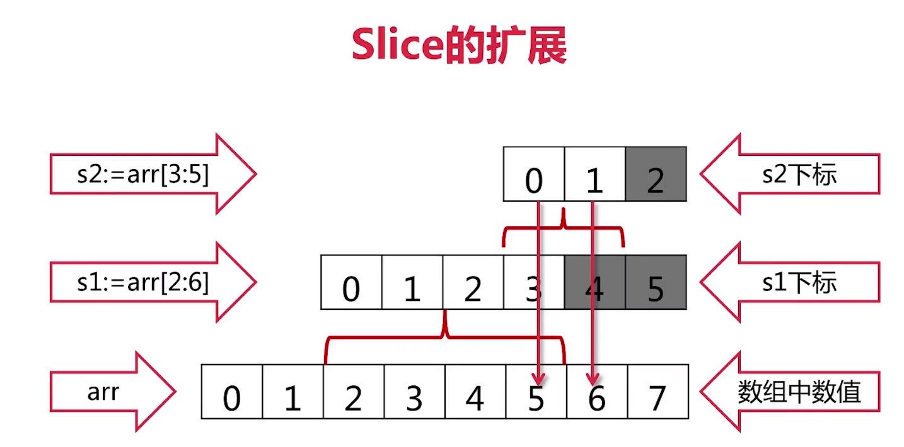
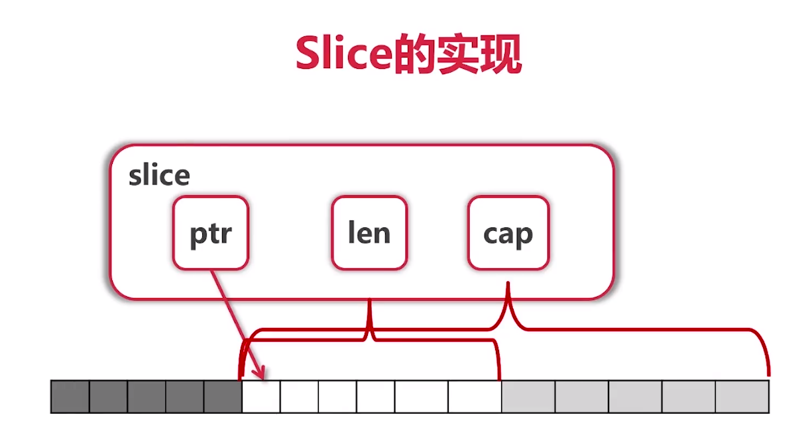

# Slice

```go
arr := [...]int{0, 1, 2, 3, 4, 5, 6, 7, 8, 9}
s := arr[2:6]

// s 的值为 [2, 3, 4, 5]    取的是半开半闭区间 前开后闭

fmt.Println("arr[2:6] = ", arr[2:6])
fmt.Println("arr[2:] = ", arr[2:])
fmt.Println("arr[:6] = ", arr[:6])
fmt.Println("arr[:] = ", arr[:])
```

`Slice` 是对 `Array` 的视图 ( `View` )

```go

func updateSlice(s []int) {
	s[0] = 100
}

fmt.Println("after updateSlice (s1)")
updateSlice(s1)
fmt.Println(s1)
fmt.Println(arr)

fmt.Println("after updateSlice (s2)")
updateSlice(s2)
fmt.Println(s2)
fmt.Println(arr)


// after updateSlice (s1)
// [100 3 4 5]
// [0 1 100 3 4 5 6 7 8 9]
// after updateSlice (s2)
// [100 1 100 3 4 5 6 7 8 9]
// [100 1 100 3 4 5 6 7 8 9]
```


数组中的案例就可以改成以 `Slice` 形式来处理，就不需要指针了
```go
func printArray(s []int) {
    for i := range s {
        fmt.Println(s[i])
    }
}

printArray(arr[:])
```

* `Slice` 本身是没有数据的，是对底层 `array` 的一个 `view`
* 所以原数组也会跟着 `Slice` 的值的改变而改变

*** 
***Reslice***

```go
s := arr[:]
s = s[1:]
s = s[:2]
```

Slice的扩展
```go
arr11 := [...]int{0, 1, 2, 3, 4, 5, 6, 7}
s11 := arr11[2:6]
s22 := s11[3:5]
fmt.Println(s11, s22)

// s1的值是多少？
// s2的值是多少？

// [2 3 4 5] [5 6]
```
Slice的扩展


Slice的实现  


使用方括号去取值 大于等于len长度的值会报错，如果是slice，只要不超过cap就都可以取到值。


* ***Slice是可以向后扩展的，不可以向前扩展***
* ***s[i]不可以超越len(s)，向后扩展不可以超越底层数组的cap(s)***

```go
arr11 := [...]int{0, 1, 2, 3, 4, 5, 6, 7}
s11 := arr11[2:6]
s22 := s11[3:5]
fmt.Printf("s11 = %v, len(s11) = %d, cap(s11) = %d\n",
    s11, len(s11), cap(s11))
fmt.Printf("s22 = %v, len(s22) = %d, cap(s22) = %d\n",
    s22, len(s22), cap(s22))

// s11 = [2 3 4 5], len(s11) = 4, cap(s11) = 6
// s22 = [5 6], len(s22) = 2, cap(s22) = 3
```

向Slice添加元素


```go
s33 := append(s22, 10)
s44 := append(s33, 11)
s55 := append(s44, 12)
fmt.Println("s33, s44, s55 =", s33, s44, s55)
fmt.Println("arr11 =", arr11)

// s33, s44, s55 = [5 6 10] [5 6 10 11] [5 6 10 11 12]
// arr11 = [0 1 2 3 4 5 6 10]
```

* 添加元素时如果超过cap，系统会重新分配更大的底层数组  
* 由于值传递的关系，必须接收append的返回值  

`var s []int // Zero value for slice is nil`


```go
	fmt.Println("Creating slice")
	var s []int

	for i := 0; i < 100; i++ {
		printSlice(s)
		s = append(s, 2*i+1)
	}
	/*
		[], len(s) = 0, cap(s) = 0
		[1], len(s) = 1, cap(s) = 1
		[1 3], len(s) = 2, cap(s) = 2
		[1 3 5], len(s) = 3, cap(s) = 4
		[1 3 5 7], len(s) = 4, cap(s) = 4
		[1 3 5 7 9], len(s) = 5, cap(s) = 8
		[1 3 5 7 9 11], len(s) = 6, cap(s) = 8
		[1 3 5 7 9 11 13], len(s) = 7, cap(s) = 8
		[1 3 5 7 9 11 13 15], len(s) = 8, cap(s) = 8
		[1 3 5 7 9 11 13 15 17], len(s) = 9, cap(s) = 16
		[1 3 5 7 9 11 13 15 17 19], len(s) = 10, cap(s) = 16
		[1 3 5 7 9 11 13 15 17 19 21], len(s) = 11, cap(s) = 16
		[1 3 5 7 9 11 13 15 17 19 21 23], len(s) = 12, cap(s) = 16
	*/
	fmt.Println(s)
	s1 := []int{2, 4, 6, 8}
	printSlice(s1)
	// [2 4 6 8], len(s) = 4, cap(s) = 4

	s2 := make([]int, 16)
	s3 := make([]int, 10, 32)
	printSlice(s2)
	printSlice(s3)
	// [0 0 0 0 0 0 0 0 0 0 0 0 0 0 0 0], len(s) = 16, cap(s) = 16
	// [0 0 0 0 0 0 0 0 0 0], len(s) = 10, cap(s) = 32
	fmt.Println("copying slice")
	copy(s2, s1)
	printSlice(s2)
	// [2 4 6 8 0 0 0 0 0 0 0 0 0 0 0 0], len(s) = 16, cap(s) = 16

	fmt.Println("deleting elements from slice")
	s2 = append(s2[:3], s2[4:]...) // php is ...s2
    fmt.Println(s2)
	// [2 4 6 0 0 0 0 0 0 0 0 0 0 0 0]
    

    fmt.Println("Popping from front")
	front := s2[0]
	s2 = s2[1:]
    //
	fmt.Println("Popping from back")
	tail := s2[len(s2)-1]
	s2 = s2[:len(s2)-1]
    fmt.Println(front, tail)
    // 2 0
    printSlice(s2)
    // [4 6 0 0 0 0 0 0 0 0 0 0 0], len(s) = 13, cap(s) = 15
```